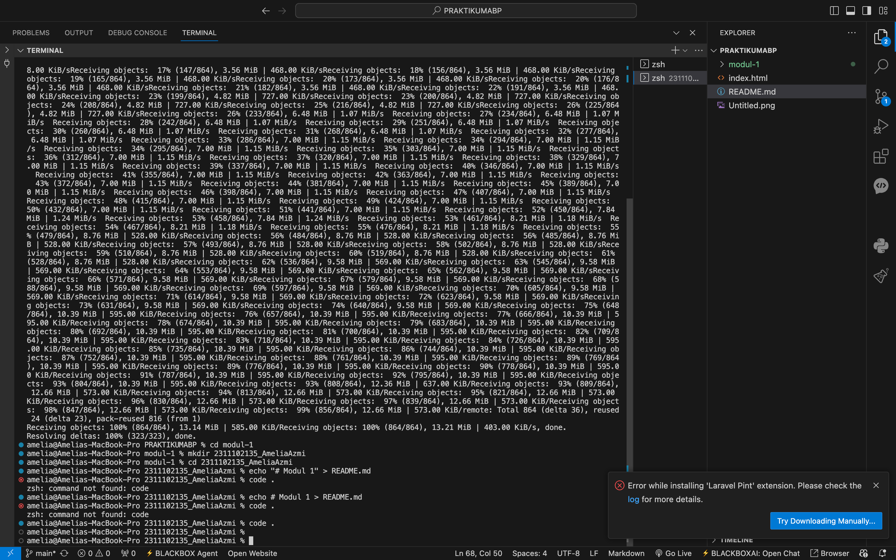

# Modul 1
# Aplikasi Berbasis Platform (ABP)

## Pendahuluan
Selamat datang di repositori mata kuliah **Aplikasi Berbasis Platform** S1IF-11-05!

Mata kuliah ini dirancang untuk membekali mahasiswa dengan kemampuan membangun aplikasi yang efisien, skalabel, dan tangguh menggunakan bahasa pemrograman **Dart (Flutter)** untuk aplikasi mobile dan **PHP (Laravel)** untuk backend. Repositori ini akan menjadi panduan utama Anda dalam mengeksplorasi sintaksis, logika, hingga implementasi platform.

---

**Selamat, Berjuang, Suksess**

## Format Laporan Praktikum (README.md)

<div align="center">
  <br />
  <h1>LAPORAN PRAKTIKUM <br> APLIKASI BERBASIS PLATFORM </h1>
  <br />
  <h3>MODUL 1 <br> Instalasi dan GIT </h3>
  <br />
  
  <br />
  <br />
  <br />
  <h3>Disusun Oleh :</h3>
  <p>
    <strong>Amelia Azmi</strong>
    <br>
    <strong>2311102135</strong>
    <br>
    <strong>S1 IF-11-REG05</strong>
  </p>
  <br />
  <h3>Dosen Pengampu :</h3>
  <p>
    <strong>Dedi Agung Prabowo, S.Kom., M.Kom</strong>
  </p>
  <br />
  <br />
  <h4>Asisten Praktikum :</h4>
  <strong>Apri Pandu Wicaksono </strong>
  <br>
  <strong>Hamka Zaenul Ardi</strong>
  <br />
  <h3>LABORATORIUM HIGH PERFORMANCE <br>FAKULTAS INFORMATIKA <br>UNIVERSITAS TELKOM PURWOKERTO <br>2026 </h3>
</div>

<hr>

# Dasar Teori

Git adalah sistem kontrol versi (Version Control System/VCS) yang digunakan untuk mencatat, menyimpan, dan mengatur setiap perubahan pada file dalam suatu proyek, terutama dalam pengembangan perangkat lunak. Sistem ini dikembangkan oleh Linus Torvalds pada tahun 2005 untuk menunjang pengembangan sistem operasi Linux. Dengan Git, setiap perubahan kode direkam dalam bentuk commit, sehingga riwayatnya dapat dilihat kembali, dibandingkan, atau dikembalikan ke versi sebelumnya dengan mudah.

Sementara itu, GitHub merupakan platform berbasis web yang berfungsi untuk menyimpan dan mengelola repository Git secara online. Platform ini menyediakan berbagai fitur kolaboratif, seperti pengelolaan branch, pull request, dan pelacakan perubahan kode, yang mempermudah kerja sama tim dalam satu proyek. Selain itu, GitHub juga mendukung pengguna untuk berbagi kode serta mengelola proyek secara lebih sistematis.

Dengan menggunakan Git sebagai sistem kontrol versi dan GitHub sebagai layanan penyimpanan repository, proses pengembangan perangkat lunak menjadi lebih efektif, terstruktur, dan mendukung kolaborasi tim dalam membangun serta memelihara proyek.

# Tugas 1
```
//2311102135
//Amelia Azmi

Download dan install Git
Buka Terminal, lalu ketik git --version untuk memastikan Git sudah terpasang
Clone repository MODUL 1 git clone https://github.com/Aplikasi-Berbasis-Platform-S1IF-11-05/modul-1.git
Masuk ke folder repo cd modul-1
Buat folder NIM_NAMA mkdir 2311102135_AmeliaAzmi
Masuk ke folder tersebut cd 2311102135_AmeliaAzmi
Buat file README.md echo # Modul 1 > README.md
Buka dan edit di VS Code code .
Setelah selesai, kembali ke folder repo cd ..
Tambahkan ke Git git add .
Commit perubahan git commit -m "Modul 1"
Lakukan sinkronisasi git pull --rebase origin main
Push ke repository git push origin main

```

## **Screenshot Program**


