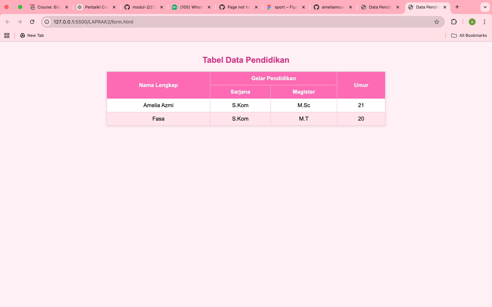

<div align="center">
  <br />
  <h1>LAPORAN PRAKTIKUM <br> APLIKASI BERBASIS PLATFORM </h1>
  <br />
  <h3>MODUL 2 <br> HTML </h3>
  <br />
  
  <br />
  <br />
  <br />
  <h3>Disusun Oleh :</h3>
  <p>
    <strong>Amelia Azmi</strong>
    <br>
    <strong>2311102135</strong>
    <br>
    <strong>S1 IF-11-REG05</strong>
  </p>
  <br />
  <h3>Dosen Pengampu :</h3>
  <p>
    <strong>Dedi Agung Prabowo, S.Kom., M.Kom</strong>
  </p>
  <br />
  <br />
  <h4>Asisten Praktikum :</h4>
  <strong>Apri Pandu Wicaksono </strong>
  <br>
  <strong>Hamka Zaenul Ardi</strong>
  <br />
  <h3>LABORATORIUM HIGH PERFORMANCE <br>FAKULTAS INFORMATIKA <br>UNIVERSITAS TELKOM PURWOKERTO <br>2026 </h3>
</div>

<hr>

# Dasar Teori
# Dasar Teori HTML

## 1. Penjelasan HTML
HTML (HyperText Markup Language) merupakan bahasa markup yang digunakan untuk menyusun kerangka dasar sebuah halaman web. HTML berfungsi mengatur tampilan berbagai jenis konten seperti teks, gambar, tautan, tabel, serta elemen lainnya agar dapat ditampilkan dengan baik di browser.

HTML tidak termasuk bahasa pemrograman karena tidak memiliki struktur logika seperti perulangan maupun percabangan. Fungsinya hanya sebagai penanda atau pengatur struktur melalui penggunaan tag.

* **HyperText**: kemampuan untuk menghubungkan satu halaman dengan halaman lainnya melalui tautan.
* **Markup**: proses memberikan tanda atau penanda pada konten menggunakan tag.

Versi yang paling banyak digunakan saat ini adalah **HTML5**, yang sudah mendukung berbagai fitur modern seperti pemutaran audio, video, serta elemen interaktif.

---

## 2. Sejarah Singkat HTML
HTML pertama kali diperkenalkan oleh Tim Berners-Lee pada awal tahun 1990-an sebagai bagian dari pengembangan World Wide Web. Pada awalnya, HTML digunakan untuk berbagi dokumen sederhana.

Seiring perkembangan teknologi, HTML terus mengalami pembaruan hingga lahir HTML5 sebagai versi terbaru yang menawarkan peningkatan dari sisi struktur dan dukungan multimedia.

---

## 3. Peran HTML dalam Pengembangan Web
Dalam pengembangan web, HTML bekerja bersama dua teknologi utama lainnya:

| Teknologi   | Peran                        |
|------------|-------------------------------|
| HTML       | Menyusun struktur pada konten |
| CSS        | Mengatur tampilan             |
| JavaScript | Menambahkan interaktivitas    |

HTML menjadi fondasi utama karena semua elemen web dibangun di atas struktur HTML.

---

## 4. Struktur Dasar Dokumen HTML
Struktur dasar dokumen HTML terdiri dari beberapa bagian utama, yaitu:

* `<!DOCTYPE html>` → Menunjukkan bahwa dokumen menggunakan HTML5
* `<html>` → Elemen inti yang membungkus seluruh isi halaman
* `<head>` → Berisi informasi tambahan seperti judul, karakter set, dan metadata lainnya
* `<body>` → Memuat konten utama yang akan ditampilkan pada halaman web

Bagian `<head>` tidak ditampilkan secara langsung kepada pengguna, sedangkan seluruh isi yang terlihat berada di dalam `<body>`.


## 5. Konsep Dasar HTML

Beberapa konsep penting dalam HTML:

| Istilah       | Penjelasan                                                     |
|--------------|-----------------------------------------------------------------|
| Tag          | PTanda untuk menandai elemen yang ditulis dengan simbol <>      |
| Elemen       | Susunan yang terdiri dari tag awal, isi, dan tag akhir          |
| Atribut      | Data tambahan yang disisipkan di dalam sebuah tag               |
| Self-closing | Tag yang berdiri sendiri tanpa tag penutup                      |
| Nested       | Elemen yang ditempatkan di dalam elemen lainnya                 |


# Tugas 2
```
//2311102135
//Amelia azmi

# Penugasan 2: Pembuatan Tabel HTML (Web Purba)

## Deskripsi Tugas
Pada penugasan ini, mahasiswa diminta untuk membuat sebuah tampilan tabel sederhana menggunakan HTML. Tabel tersebut harus berisi data dasar.

---

### Kode Program

</html>

<!DOCTYPE html>
<html lang="id">

<head>
    <meta charset="UTF-8">
    <title>Data Pendidikan & Mahasiswa</title>

    <style>
        body {
            font-family: Arial, sans-serif;
            background-color: #fff0f5;
            margin: 40px;
        }

        h2 {
            text-align: center;
            color: #d63384;
        }

        table {
            margin: 20px auto;
            border-collapse: collapse;
            width: 60%;
            background-color: #ffffff;
            box-shadow: 0 2px 8px rgba(0, 0, 0, 0.1);
        }

        th,
        td {
            padding: 10px;
            text-align: center;
            border: 1px solid #f5c2d7;
        }

        th {
            background-color: #ff69b4;
            color: white;
        }

        tr:nth-child(even) {
            background-color: #ffe4ec;
        }

        tr:hover {
            background-color: #ffd6e8;
        }
    </style>
</head>

<body>

    <h2>Tabel Data Pendidikan</h2>

    <table>
        <tr>
            <th rowspan="2">Nama Lengkap</th>
            <th colspan="2">Gelar Pendidikan</th>
            <th rowspan="2">Umur</th>
        </tr>
        <tr>
            <th>Sarjana</th>
            <th>Magister</th>
        </tr>
        <tr>
            <td>Amelia Azmi</td>
            <td>S.Kom</td>
            <td>M.Sc</td>
            <td>21</td>
        </tr>
        <tr>
            <td>Fasa</td>
            <td>S.Kom</td>
            <td>M.T</td>
            <td>20</td>
        </tr>
    </table>

</body>

</html>


## **Screenshot Program**

